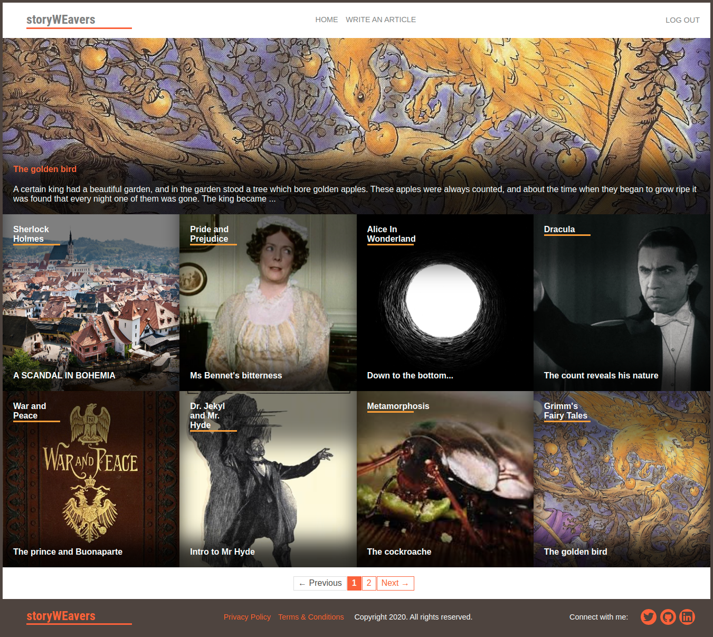

<!-- PROJECT LOGO -->
<br />
<p align="center">
  <a href="https://github.com/phfdonda/story-weavers">
    
  </a>

  <h3 align="center">Tic-Tac-Toe Game</h3>

  <p align="center">
    This project is part of the Microverse Ruby Section inspired in
    <br />
    <a href="https://www.theodinproject.com/courses/ruby-on-rails">The Odin Project curriculum</a>
    <br />
    <a href="https://github.com/phfdonda/story-weavers/issues">Report Bug</a>
    ·
    <a href="https://github.com/phfdonda/story-weavers/request_feature">Request Feature</a>
  </p>
</p>

## Live Version
[storyWEavers](https://story-weavers.herokuapp.com/)

This is an app deployed in Heroku, so please wait 30 seconds for it to load the first time.

The page looks like this:


<!-- TABLE OF CONTENTS -->
## Table of Contents

* [About the Project](#about-the-project)
  * [Installation](#installation)
  * [Instructions](#instructions)
  * [Built With](#built-with)
  * [Development Process](#development-process)
  * [Testing](#testing)
* [Contact](#contact)
* [Acknowledgements](#acknowledgements)

<!-- ABOUT THE PROJECT -->
## About The Project

This is my Capstone Project for Ruby on Rails, the final assignment for the RoR course in Microverse curriculum. It is a real-world-like project, meant to emulate the specifications of a real website required by a client. I had to achieve the following aspects:

1. The style should follow this design: [Lifestyle Blog](https://www.behance.net/gallery/14554909/liFEsTlye-Mobile-version), created by [Nelson Sakwa](https://www.behance.net/sakwadesignstudio).
2. It is meant only for desktop browsers, so no responsiveness is required for this project in particular.
3. I should create my own theme for the website.
4. Whatever theme I choose, I should not get too carried away (harder than it seems) - instead, the purpose is to create a MVP version of the app that can be extended in the future.
5. The database should "reflect" this ERD:
 
6. The columns names shouldn't be changed.
7. We have three pages required for this project:
  - **Main Page:** The most voted article is displayed in the main page, full width. It contains its title and a part of the text. Bellow comes squares representing all the        categories, sorted by priority - whatever that is. Each of these squares has a background image that is taken from the latest article of respective category. On the top of the square comes the name of the category, and on the bottom comes the title of this same latest article.
  - **Category's list of articles:** When you click the category's box on the main page, you're taken to this category's list of articles, sorted by most recent, where you can see them displayed in rows, two for each. They are divided in two boxes: an image box, and a text box. The image box has nothing else apart from the image, but the text box comes with: category name, title, text (truncated if necessary), the author's name and at the end it must have a button to vote or unvote. A user should be able to vote only one time in each article.
  - **New Article:** On the navbar there must be a link to create a new article. This page must follow the same style of the rest of the website.
8. It is not a requirement to create a secure login using passwords. A user should be able to login only typing their name.
9. All pages have the same navbar and footer. The navbar should contain the logo to the left and the ```Home``` and ```Write an Article``` links.
8. At the end I should add a feature of my own.


The goals of this project are to:

- Use MVP architectural pattern
- Configure RESTFUL routes
- Use controllers to intercept user requests
- Use view templates for HTML with embedded data
- Use assets pipeline
- Connect Database to app
- Use Active Record:
    - as ORM
    - associations to model real life system (based on Database schema)
    - queries to translate app requirements to SQL queries
    - validations
- Pass user input from view through controller to model in a safe way
- Remember about thin controllers and distinction between logic and presentation tiers
- Avoid n+1 queries problem
- Use unit tests (Rspec)
- Deploy apps (Heroku, Netlify)
- Translate business requirements into software solutions
- Multitask and effectively manage time and prioritization
- Use strong English verbal and written communication
- Communicate information effectively to technical people


## Installation

Ruby is needed to run this file. Follow these steps to install it:
[TOP - Install Ruby](https://www.theodinproject.com/courses/web-development-101/lessons/installing-ruby)

Rails is also needed. To install it, follow the instructions in this link: [TOP - Install Ruby on Rails](https://www.theodinproject.com/courses/ruby-on-rails/lessons/your-first-rails-application-ruby-on-rails)

You can download the [repo](https://github.com/phfdonda/story-weavers) or clone (paste on the terminal) ```git clone git@github.com:phfdonda/story-weavers.git```

Open the terminal and cd to the path where you download the project. It should be something like: ```User/<folder>/story-weavers/```.

To open it in your browser, you'll have to set a local server. To do that, in this terminal type ```rails server```, or ```rails s``` for short. By default the port is set to 3000. In your browser url bar, type ```localhost:3000```.

Enjoy!!

### Built With
* Ruby
* Rails
* VsCode
* Rubocop and Stickler for linting

## Development Process
I decided the theme beforehand, as if I was a client passing her business requirements before hiring me. I decided the name of the website would be storyWEavers.

### Business requirements
The business concept of the website is this: **the same way we programmers can open-source the development of software, with descentralized contribution of the community, what if we could open-source the development of stories?**
My concept is a website where people can write their contributions that, if approved, will be "merged" into the main line of the story. Each chapter is actually a competion of sorts, where people can send their versions. During a timespan, creators can write and publish "threads". The community can vote, propose changes, and if any of the most voted meets the criteria of the editing team, the chapter becomes part of the stream of events.
The website is called storyWEavers because, like weavers, people will contribute with threads. After these threads are woven into a single fabric, we can publish the story - and the profits go to the contributors and the editing team. Since there's no single writer, but many writers called 'weavers', the focus is on the WE. It is a collaborative project of sorts, tapping into the collective creativity. How many great stories can be born like this?

### Translation of business requirements into software design
This is a project created initially as a Capstone Project for the Microverse course - so I have to follow the requirements of the project, at least until it is approved. After that I can take this project to new horizons.
As seen in the ERD, we have to create the following tables:
- Users
- Articles
- Categories
- Votes

However, although it is required of me to create a database that "reflects" this ERD, there is a fundamental flaw in the relationship diagram: we have a many-to-many relationship between Category and Article tables. I have to fix that, and by doing so it no longer "reflects" the ERD. The requirements of the project have no strict directions about this, so it is up to me. There are two options, if I want to make it as similar as possible: first, I could create a whole new table to make a "through" relationship; the other one is just changing the many-to-many into one-to-many.

The option that is most similar to the ERD is the last one, since we don't have to create a table that isn't there. Also, it better reflects our business requirements: if we consider the "category" a story, and each "article" a chapter, then you can't have a chapter that belongs to many stories, but a story will have many chapters. Therefore, one Category have many Articles still, but an Article has only one Category.

The business requirements would demand a "Comments" table, so users could comment to suggest modifications on possible chapters. However, we don't have that table in the ERD, and this project is a MVP. Let's leave that for later.

Users can vote, and those votes can be used for later logic - for example, to choose the "thread" that is going to be merged. For now, it's only used to choose the featured article that is displayed in the front page.

## Testing
For testing I used the gems ```faker```, ```factory_bot```, ```capybara```, and ```rspec_rails```, among a few others.

To test by yourself, open the terminal, cd into the folder and run ```rspec````.

<!-- CONTACT -->
## Contact

Pedro Henrique Ferreira Donda

Github - [@phfhdonda](https://github.com/phfdonda)

LinkedIn - [PedroDonda](https://www.linkedin.com/in/pedro-donda-808621bb/)


<!-- ACKNOWLEDGEMENTS -->
## Acknowledgements
* [Microverse](https://www.microverse.org/)
* [The Odin Project](https://www.theodinproject.com/)
* [Ruby](https://www.ruby-lang.org/en/)
* [Nelson Sakwa](https://www.behance.net/sakwadesignstudio)
